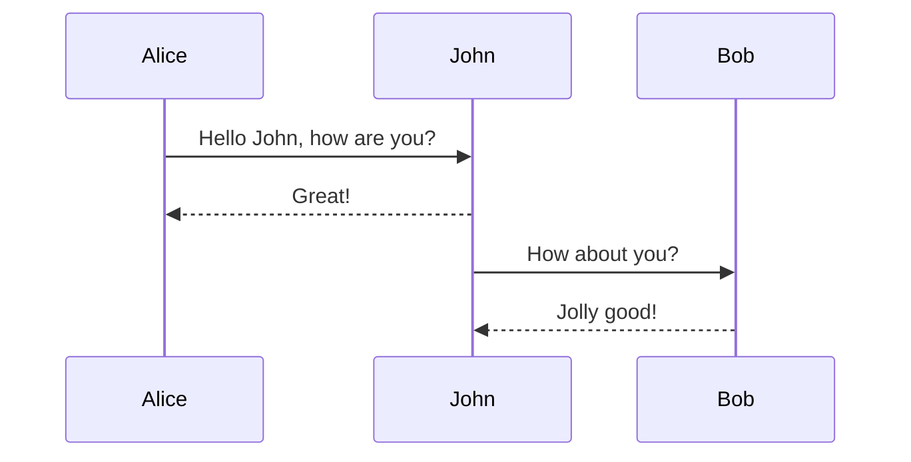
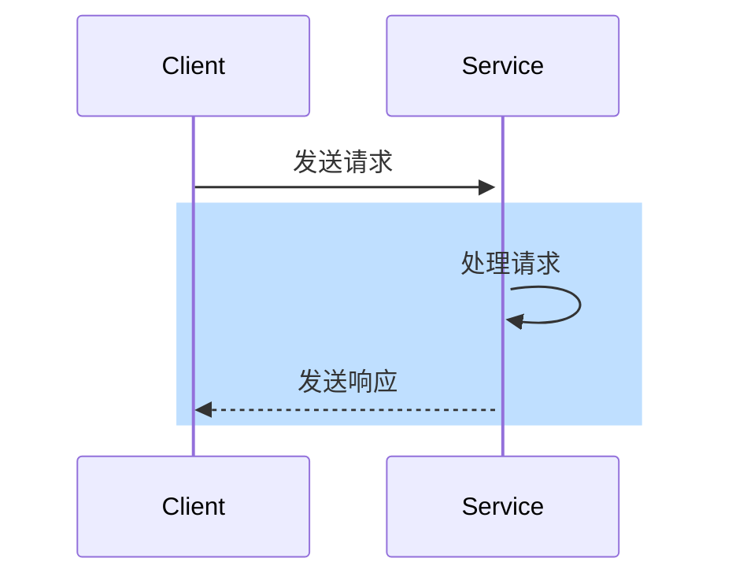
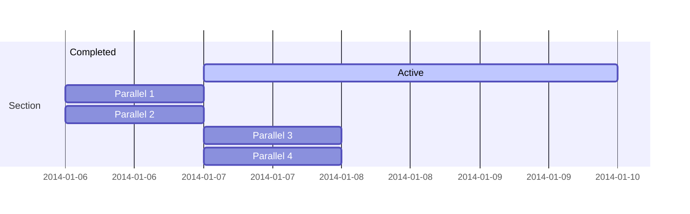
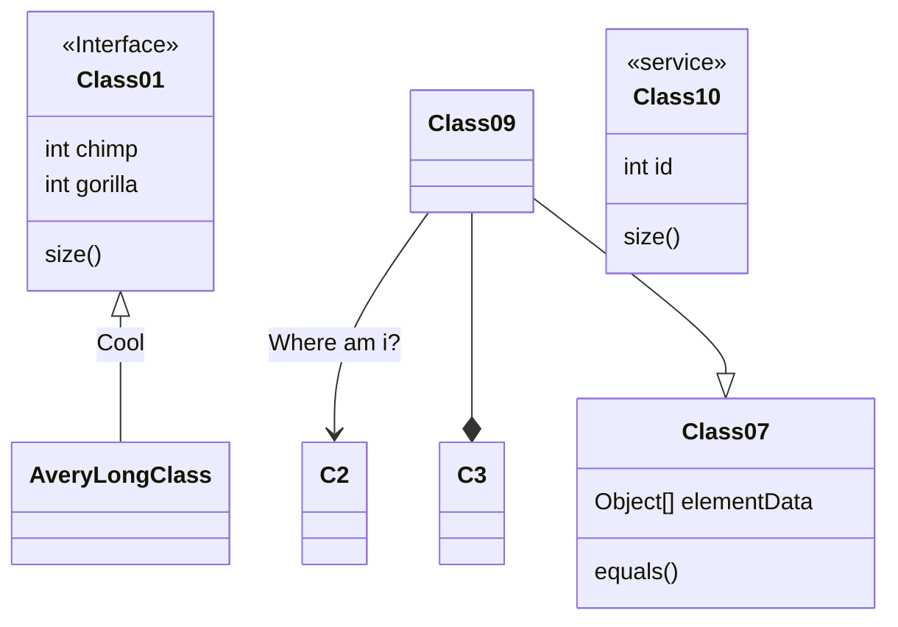
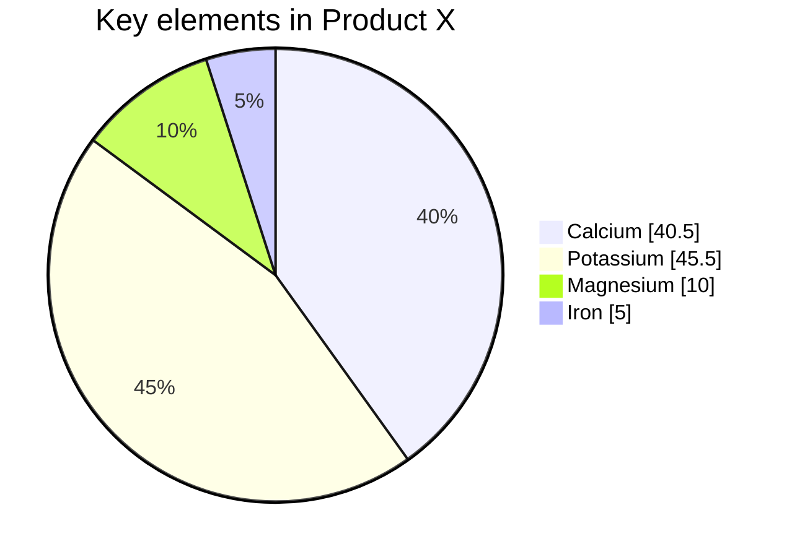
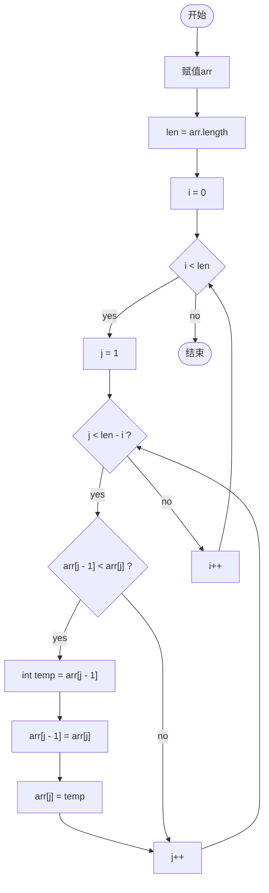
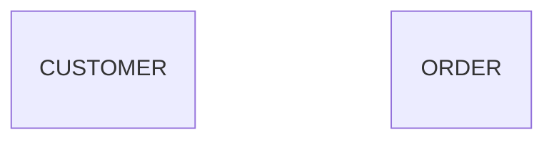
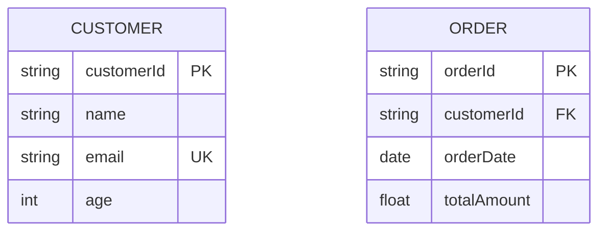
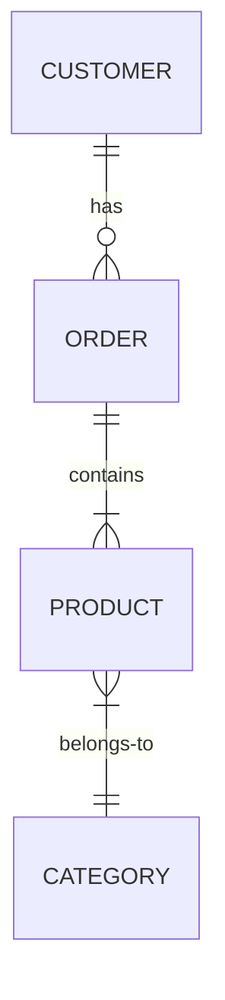
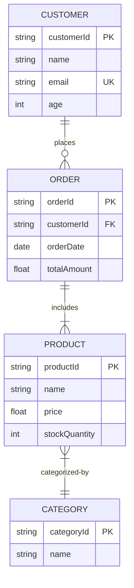

# mermaid

Markdown - [mermaid](https://mermaid.js.org/intro/)

## flowchart

## sequenceDiagram

> 1

> 2

## gantt

## classDiagram

## pie

## graph

## erDiagram

### 属性 (Attributes)

属性描述实体的特性，它紧跟在实体名称下方，并用一个冒号 : 分隔。属性可以带有类型和可选的键：

- 属性名 类型: 这是最基本的属性定义。
- 属性名 类型 `PK`: 表示主键 (Primary Key)。
- 属性名 类型 `FK`: 表示外键 (Foreign Key)。
- 属性名 类型 `UK`: 表示唯一键 (Unique Key)。

### 关系 (Relationships)

关系连接两个实体，描述它们之间的联系。Mermaid `erDiagram` 支持多种关系类型，每种类型都有对应的符号：

关系连接符：

- `--` : 无具体方向或默认关系。
- `--o` : 从左到右的开放箭头，通常表示“可以有”或“可选”。
- `o--` : 从右到左的开放箭头。
- `--|` : 从左到右的实心箭头，通常表示“必须有”或“一对一”。
- `|--` : 从右到左的实心箭头。

### 关系基数 (Cardinality)

基数表示一个实体实例与另一个实体实例关联的数量。它紧随在连接符之后，用以下符号表示：

- `|o--||`：一对一 (One to One)
- `|o--o{`：一对零个或一个 (One to Zero or One)
- `|o--|{`：一对一个或多个 (One to One or Many)
- `||--|{`：一对多个 (One to Many)
- `o{--o|`：零个或一个对一个 (Zero or One to One)
- `o{--o{`：零个或一个对零个或一个 (Zero or One to Zero or One)
- `o{--|{`：零个或一个对一个或多个 (Zero or One to One or Many)
- `|{--o|`：一个或多个对一个 (One or Many to One)
- `|{--o{`：一个或多个对零个或一个 (One or Many to Zero or One)
- `|{--|{`：一个或多个对一个或多个 (One or Many to One or Many)

### 关系名称

关系可以有一个描述性的名称，放在两个实体中间，用冒号 `:` 分隔。

### 完整示例

将上述概念结合起来，一个更完整的 `ER` 图示例

这个示例展示了客户下订单，订单包含产品，产品属于某个分类的场景

