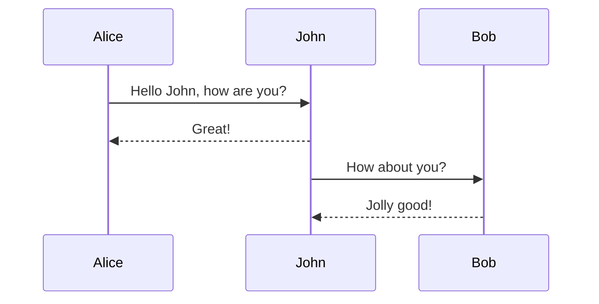
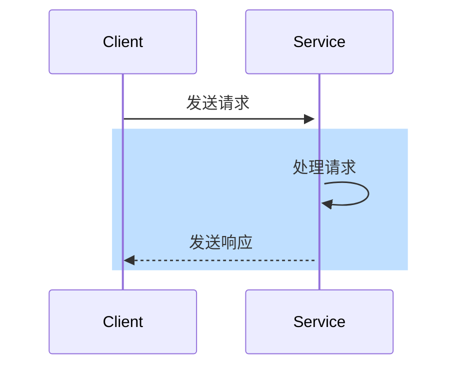
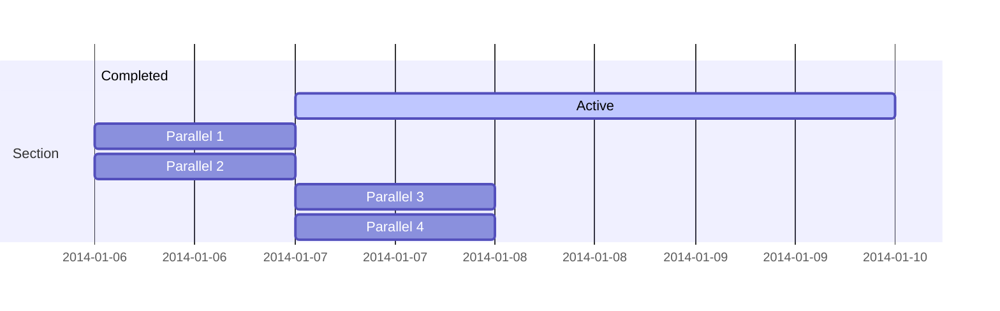
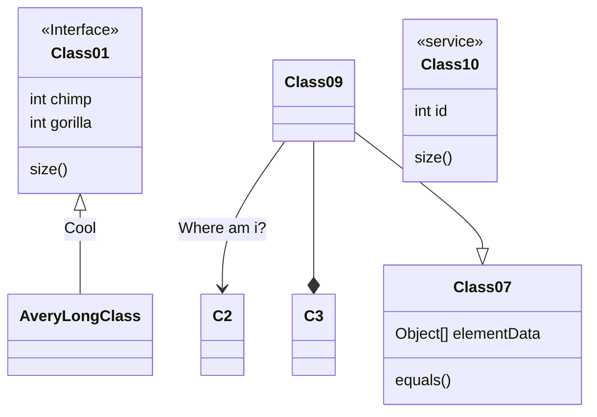
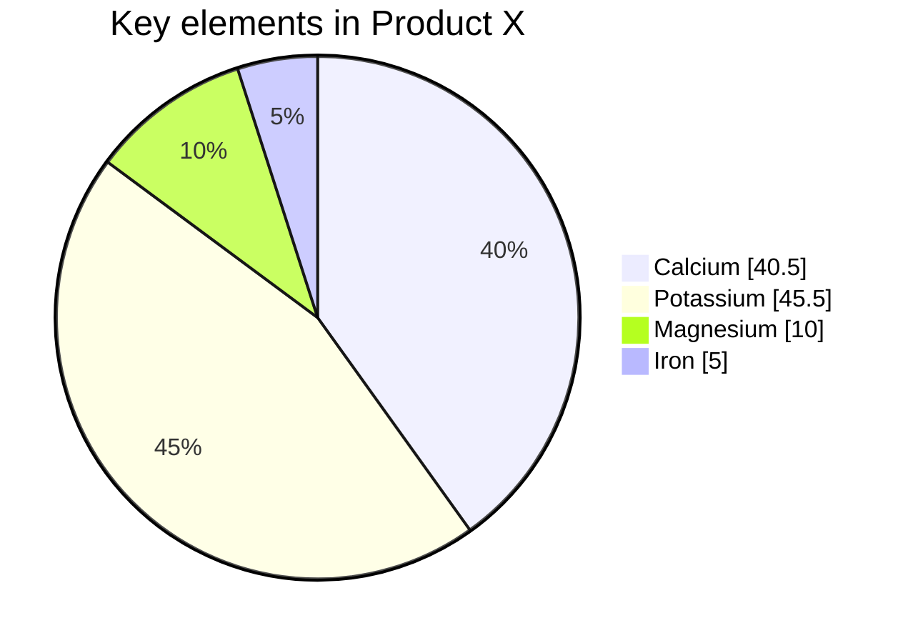
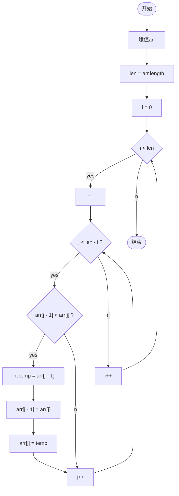

# mermaid

Markdown - [mermaid](https://mermaid.js.org/intro/)

## flowchart

```mermaid
flowchart TD
    A-->B;
    A-->C;
    B-->D;
    C-->D;
```

## sequenceDiagram

>1

```mermaid
sequenceDiagram
    Alice->>John: Hello John, how are you?
    #loop Healthcheck
    #John->>John: Fight against hypochondria
    #end
    #Note right of John: Rational thoughts!
    John-->>Alice: Great!
    John->>Bob: How about you?
    Bob-->>John: Jolly good!
```

>2

```mermaid
sequenceDiagram
    Client ->> +Service : 发送请求
    rect rgb(191, 223, 255)
    Service ->> Service : 处理请求
    Service -->> Client : 发送响应
    end
```

## gantt

```mermaid
gantt
section Section
    Completed :done,    des1, 2014-01-06,2014-01-08
    Active        :active,  des2, 2014-01-07, 3d
    Parallel 1   :         des3, after des1, 1d
    Parallel 2   :         des4, after des1, 1d
    Parallel 3   :         des5, after des3, 1d
    Parallel 4   :         des6, after des4, 1d
```

## classDiagram

```mermaid
classDiagram
    Class01 <|-- AveryLongClass : Cool
    <<Interface>> Class01
    Class09 --> C2 : Where am i?
    Class09 --* C3
    Class09 --|> Class07
    Class07 : equals()
    Class07 : Object[] elementData
    Class01 : size()
    Class01 : int chimp
    Class01 : int gorilla
    class Class10 {
    <<service>>
    int id
    size()
    }
```

## pie

```mermaid
pie showData
    title Key elements in Product X
    "Calcium" : 40.50
    "Potassium" : 45.5
    "Magnesium" : 10
    "Iron" :  5
```

## graph

```mermaid
graph TD
    start([开始]) --> 赋值arr[赋值arr]
    赋值arr --> 赋值len[len = arr.length]
    赋值len --> 赋值i[i = 0]
    赋值i --> 第一层循环{i < len}
    第一层循环 --yes--> 赋值j[j = 1]
    赋值j --> 第二层循环{"j < len - i ?"}
    第二层循环 --yes--> 判断{"arr[j - 1] < arr[j] ?"}
    判断 --yes--> 定义临时变量["int temp = arr[j - 1]"]
    定义临时变量 --> 交换aj["arr[j - 1] = arr[j]"]
    交换aj --> 交换aj-1["arr[j] = temp"]
    交换aj-1 --> j自增["j++"]
    j自增 --> 第二层循环
    判断 --no--> j自增
    第二层循环 --no--> i自增["i++"]
    i自增 --> 第一层循环
    第一层循环 --no--> endd([结束])
```
